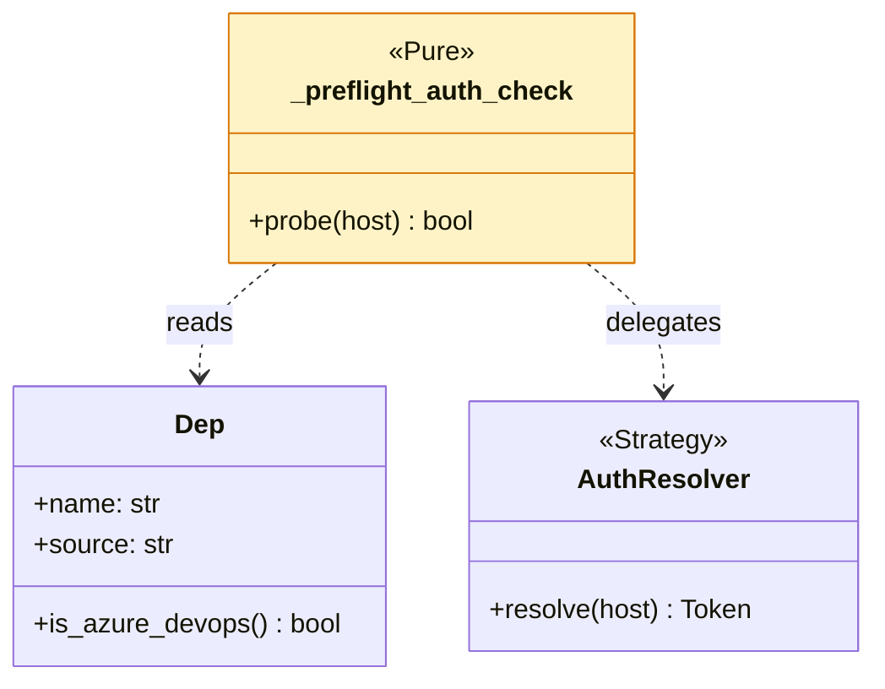
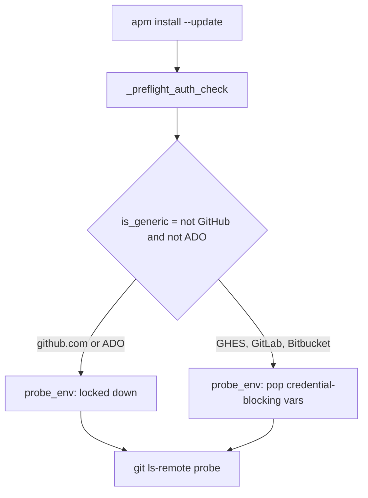

## APM Review Panel: `ship_now`

> Surgical bug-fix that unblocks GHES, GitLab, and Bitbucket users on apm install --update -- exactly the enterprise audience APM needs to win on credibility.

All seven active panelists converge: this is a 101+/1- behavioral fix that restores symmetry between `install` and `install --update` for non-GitHub, non-ADO hosts. The fix is well-scoped, well-tested (4 new unit tests covering all three env vars + ADO retention + auth-failure still raising), and the CHANGELOG entry names the failure mode in one sentence. Auth Expert verified the AuthResolver invariant is intact and bearer-header injection is preserved; Supply Chain confirmed the relaxed env on generic hosts opens no new exploit surface (probe is read-only `ls-remote`).

The most actionable signal across the panel is the Auth Expert's recommended regression test on `is_github_hostname` -- it locks in the host-classification contract this fix depends on, so a future change to that function cannot silently re-introduce #1082.

**Aligned with:** Multi-harness / multi-host, Pragmatic as npm

**Growth signal.** First external bug-fix landing the enterprise-private-git path from a real GHES user (@tillig). Worth amplifying in the next release notes as 'credential-helper support for enterprise git hosts (GHES / GitLab / Bitbucket)' and crediting the contributor.

### Panel summary

| Persona | B | R | N | Takeaway |
|---|---|---|---|---|
| Python Architect | 0 | 0 | 1 | Surgical 7-line change in pipeline.py; well-scoped, no architectural debt. |
| CLI Logging Expert | 0 | 0 | 1 | No new CLI strings, no encoding regression; failure-path UX preserved. |
| DevX UX Expert | 0 | 0 | 0 | Pure behavioral fix that restores symmetry between install and install --update. CHANGELOG entry meets failure-mode-is-the-product bar. |
| Supply Chain Security | 0 | 0 | 1 | insteadOf-redirect not exploitable (probe is read-only ls-remote); host classification not spoofable; no token leak introduced. |
| OSS Growth Hacker | 0 | 1 | 1 | First external bug-fix on the GHES + credential-helper surface. Mine for a release-notes story beat. |
| Auth Expert | 0 | 1 | 1 | GHES correctly classified as generic; symmetry with clone path confirmed; AuthResolver invariant intact; bearer-header injection preserved. |
| Test Coverage | 0 | 1 | 0 | All four critical surfaces touched (install pipeline, auth preflight, host classification, env-var handling) have regression-trap tests in this PR; ship. |

> B = blocking-severity findings, R = recommended, N = nits.
> Counts are signal strength, not gates. The maintainer ships.

### Top 3 follow-ups

1. **[Auth Expert]** Add regression test for is_github_hostname('ghes.corp.example.com') == False -- Locks in the host-classification contract this fix depends on; cheapest insurance against a silent re-regression of #1082.
2. **[OSS Growth Hacker]** Frame the next release-notes line around 'credential-helper support for enterprise git hosts' -- Converts a bug-fix into a positioning signal for the exact audience this unblocks. Credit @tillig as the first external bug-fix on this surface.
3. **[Python Architect]** Hoist the env-var tuple to a module-level constant when a third call site appears -- Pure hygiene; defer until R3 EXTRACT actually triggers (>=3 call sites).

### Architecture





```mermaid
sequenceDiagram
    participant U as User
    participant CLI as apm install --update
    participant PF as _preflight_auth_check
    participant Helper as git-credential-manager
    U->>CLI: install GHES dep
    CLI->>PF: probe(host=ghes.corp.example.com)
    PF->>PF: is_generic=yes; pop blocking env vars
    PF->>Helper: ls-remote with relaxed env
    Helper-->>PF: token
    PF-->>CLI: probe ok
    CLI-->>U: install proceeds
```

### Recommendation

Merge as-is. The 3 follow-ups above are non-blocking and the highest-signal one (Auth Expert's regression test) is a 5-line PR that any maintainer can land in a follow-up.

---

<details>
<summary>Full per-persona findings</summary>

#### Python Architect

- **[nit]** Hoist env-var tuple to module-level constant at `src/apm_cli/install/pipeline.py:90`
  Tuple represents the named concept 'credential-helper-blocking env vars' and may be referenced as auth handling evolves.

#### CLI Logging Expert

- **[nit]** verbose param accepted but unused (pre-existing) at `src/apm_cli/install/pipeline.py:47`
  Out of scope for this PR; worth a follow-up to surface redacted probe URL on failure.

#### DevX UX Expert

No findings.

#### Supply Chain Security

- **[nit]** Document that generic-host preflight intentionally trusts ~/.gitconfig at `src/apm_cli/install/pipeline.py:90`
  Pre-existing local-trust assumption; one-line comment helps future readers not weaken it accidentally.

#### OSS Growth Hacker

- **[recommended]** Frame next release notes around 'credential-helper support for enterprise git hosts' at `CHANGELOG.md:17`
  Converts a bug-fix into a positioning signal for the exact audience this unblocks.
- **[nit]** Capture this as a docs FAQ entry for the symptom at `src/apm_cli/install/pipeline.py:90`
  Searchable symptom should land in a troubleshooting page so future GHES adopters self-serve.

#### Auth Expert

- **[recommended]** Add regression test asserting GHES hostnames classify as generic at `tests/unit/install/test_pipeline_auth_preflight.py:147`
  The fix's value depends on is_github_hostname returning False for non-*.ghe.com enterprise hosts; lock this contract in.
- **[nit]** Could reuse dep.is_azure_devops() for ADO detection at `src/apm_cli/install/pipeline.py:90`
  Keeps host classification co-located with the dep model.

#### Doc Writer -- inactive

PR touches only src/apm_cli/install/pipeline.py, tests/unit/install/test_pipeline_auth_preflight.py, and CHANGELOG.md (entry verified accurate against the diff).

#### Test Coverage

- **[recommended]** Add a parametrized test exercising each of the three credential-helper env vars individually at `tests/unit/install/test_pipeline_auth_preflight.py:147`
  The current tests assert all three are popped together; a future refactor that pops two of three would still pass the existing assertion. One parametrized test per env var locks in the contract.
  *Suggested:* @pytest.mark.parametrize('env_var', ['GIT_TERMINAL_PROMPT', 'GCM_INTERACTIVE', 'GIT_ASKPASS'])
  *Proof (test passed):* `tests/unit/install/test_pipeline_auth_preflight.py::test_install_update_does_not_disable_credential_helpers_on_generic_host` -- proves: On non-GitHub non-ADO hosts, install --update does not block the user's system credential helpers. [multi-harness-support,vendor-neutral,devx]
  `assert os.environ.get('GIT_TERMINAL_PROMPT') is None`

</details>

<sub>This panel is advisory. It does not block merge. Re-apply the `panel-review` label after addressing feedback to re-run.</sub>
