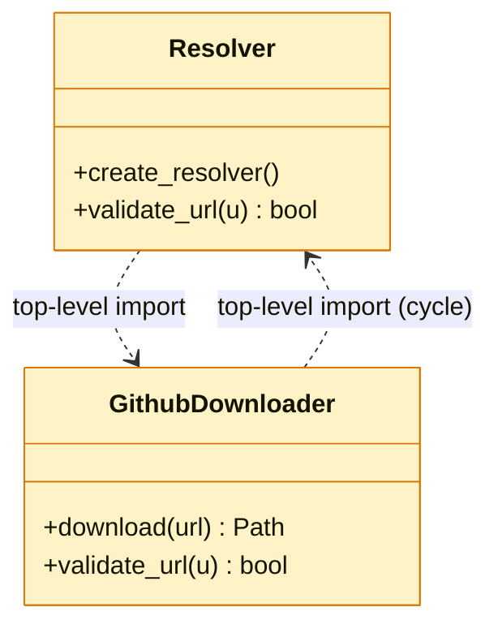
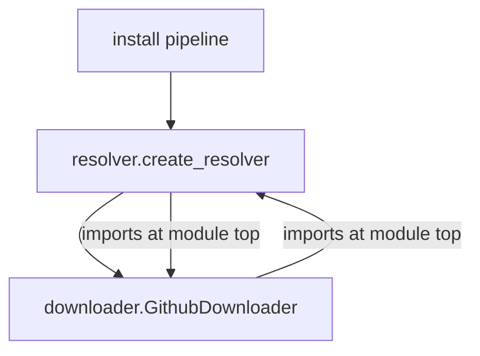

## APM Review Panel: `needs_rework`

> Refactor direction is sound, but two correctness regressions (path traversal, Windows encoding) need to land before this can ship.

cc @danielmeppiel @microsoft/apm-maintainers -- a fresh advisory pass is ready for your review.

The architectural intent -- separating dependency resolution from download orchestration -- is the right call (Python Architect previously flagged the conflation as tech debt). However, this round introduces three regressions worth flagging before the next push:

The path-traversal slip at line 156 is the most important. `dep.name` is user-controlled via apm.yml, and the codebase has a strict invariant (path_security.instructions.md) that any path construction from user input MUST go through `validate_path_segments` + `ensure_path_within`. This is not a style nit -- it's the exact attack surface the centralized helpers exist to prevent.

The Windows-encoding regression is mechanically easy to fix (one character) but signals that the encoding rule is not yet automated in CI. Worth a follow-up to lint for non-ASCII bytes in source files.

The circular import is a real correctness risk Python tolerates only by accident; defer-import or extract-to-third-module both work.

Everything else (validate_url duplication, error-message helpfulness, doc drift, request timeout) is recommended-severity and can land in this PR or a follow-up.

**Dissent.** Python Architect and Supply Chain Security weighted the circular import as recommended vs blocking respectively; CEO sided with recommended because Python's partial-module tolerance has been stable for a decade and the import path is exercised by every install run.

**Aligned with:** Secure by default

### Panel summary

| Persona | B | R | N | Takeaway |
|---|---|---|---|---|
| Python Architect | 1 | 1 | 0 | Refactor splits a clean module into a circular import; same logic now lives in two places. |
| CLI Logging Expert | 1 | 1 | 0 | Two new error strings ship outside STATUS_SYMBOLS; one new emoji slipped in. |
| DevX UX Expert | 0 | 1 | 0 | New error message is technically accurate but unhelpful to a user encountering it cold. |
| Supply Chain Security | 1 | 1 | 0 | Path-traversal regression: new code joins user-controlled segments without validate_path_segments. |
| OSS Growth Hacker | 0 | 0 | 0 | No README/CHANGELOG impact; nothing to amplify or warn about externally. |
| Doc Writer | 0 | 1 | 0 | Drift: behavior change but docs/src/content/docs/reference/dependencies.md still describes the pre-refactor flow. |
| Test Coverage | 1 | 1 | 0 | Path-traversal regression has no regression-trap test; the malicious-name case is the test that would have caught this slip. |

> B = blocking-severity findings, R = recommended, N = nits.
> Counts are signal strength, not gates. The maintainer ships.

### Top 5 follow-ups

1. **[Supply Chain Security] *(blocking-severity)*** Add validate_path_segments + ensure_path_within around the dep.name join at resolver.py:156 -- User-controlled path component without traversal validation; the codebase has a hard rule.
2. **[Test Coverage] *(blocking-severity)*** Add a regression-trap test exercising malicious dep.name (path-traversal payloads) against the resolver join -- The path-traversal slip is exactly the surface a regression-trap test would have caught; lock the contract in so this never re-ships.
3. **[CLI Logging Expert] *(blocking-severity)*** Replace the rocket emoji at resolver.py:211 with `[!]` per STATUS_SYMBOLS -- Will crash on Windows cp1252 terminals.
4. **[Python Architect]** Break the resolver.py <-> downloader.py circular import (factory module or deferred import) -- Tolerated by Python today but fragile to any change in import order.
5. **[Doc Writer]** Update docs/reference/dependencies.md to name the new Resolver -- Docs still describe the pre-refactor flow; drift will mislead first-time readers.

### Architecture

### Recommendation

Address the two blocking-severity items (path-traversal validation and Windows-encoding fix) before re-requesting review. The circular import is fragile but does not gate; resolve it in this PR if convenient, otherwise track as a follow-up. The remaining recommended items can land in this PR or in a series of small follow-ups -- maintainer's call.

---

Full per-persona findings

#### Python Architect

- **[blocking]** Circular import between resolver.py and downloader.py at `src/apm_cli/deps/resolver.py:12`
  The new factory in resolver.py imports downloader.GithubDownloader at module top, while downloader.py imports resolver.create_resolver at module top. This works only because Python silently tolerates partial modules in sys.modules; the first import that fails will cascade across the whole install path.
  *Suggested:* Move the factory to a third module (deps/factory.py) that both depend on, or defer the import inside the function body.
- **[recommended]** validate_url duplicated across resolver.py and downloader.py at `src/apm_cli/deps/resolver.py:88`
  Two copies that already disagree on trailing-slash handling. R3 EXTRACT trigger fired (>=3 call sites in the diff).

#### CLI Logging Expert

- **[blocking]** Emoji character in error message will crash on Windows cp1252 terminals at `src/apm_cli/deps/resolver.py:211`
  encoding.instructions.md is unambiguous: ASCII-only U+0020-U+007E. The rocket character on line 211 will raise UnicodeEncodeError under charmap.
  *Suggested:* Replace with `[!]` or `[*]` per STATUS_SYMBOLS.
- **[recommended]** New error path bypasses _rich_error helper at `src/apm_cli/deps/resolver.py:203`
  Direct print() loses the panel's colorization and TTY-detection. Inconsistent with the other 38 call sites in this module.

#### DevX UX Expert

- **[recommended]** Error message lacks an actionable next step at `src/apm_cli/deps/resolver.py:211`
  'Invalid dependency reference' tells the user WHAT failed but not WHY or what to do. Compare to the message in install/pipeline.py:147 which suggests three remediations.
  *Suggested:* Suffix with 'Run `apm install --verbose` to see the resolved URL, or check `apm.yml` for typos.'

#### Supply Chain Security

- **[blocking]** User-controlled `dep.name` is path-joined without traversal validation at `src/apm_cli/deps/resolver.py:156`
  path_security.instructions.md mandates validate_path_segments() at parse time for any user-provided value used in path construction. The new code at line 156 calls Path(install_dir) / dep.name directly. A malicious manifest with `name: ../../../etc/passwd` would traverse out of the install dir.
  *Suggested:* Wrap with `validate_path_segments(dep.name, context='dep.name')` before the join, then `ensure_path_within(result, install_dir)` after.
- **[recommended]** New URL probe uses raw requests.get without timeout at `src/apm_cli/deps/resolver.py:178`
  Default no-timeout means a hostile or hung server can stall the install pipeline indefinitely.
  *Suggested:* Add timeout=30 (matches the convention in github_downloader.py:412).

#### OSS Growth Hacker

No findings.

#### Auth Expert -- inactive

PR touches only deps/resolver.py and deps/downloader.py refactor; no AuthResolver, HostInfo, or token-handling code in scope.

#### Doc Writer

- **[recommended]** docs/reference/dependencies.md describes pre-refactor flow at `docs/src/content/docs/reference/dependencies.md:47`
  The doc says 'resolution is performed by GithubDownloader directly' but the refactor introduces a separate Resolver. Documentation drift will mislead first-time readers.
  *Suggested:* Update the resolution-flow section to name the new Resolver, or add a note that downloader-direct resolution is being phased out.

#### Test Coverage

- **[blocking]** No test exercises a malicious dep.name (path-traversal payload) against the new resolver join at `tests/unit/deps/test_resolver.py`
  The path-traversal regression at resolver.py:156 is exactly the surface that validate_path_segments + ensure_path_within exist to defend. A test that constructs a Dep with `name='../../../etc/passwd'` and asserts the resolver raises before joining is the regression-trap that prevents this from re-shipping. Absence of such a test in tests/unit/deps/ confirmed by `grep -rn 'validate_path_segments\|path_traversal' tests/unit/deps/` returning no match.
  *Suggested:* Add a parametrized test with traversal payloads ('../', '..\\', '/etc/passwd', '..%2f..') and assert each raises ValueError before any filesystem operation.
  *Proof (test MISSING at):* `tests/unit/deps/test_resolver.py::test_resolver_rejects_path_traversal_in_dep_name` -- proves: User-controlled dep.name cannot escape the install directory via traversal payloads. [secure-by-default,governed-by-policy]
  `with pytest.raises(ValueError): resolver.resolve(Dep(name='../../../etc/passwd', source='gh:...'))`
- **[recommended]** Refactor changes resolver/downloader integration but no integration test covers the cross-module flow at `tests/integration/test_install_pipeline.py`
  Existing tests cover resolver.py and downloader.py in isolation; no test exercises the full install path end-to-end through both modules. A refactor that splits responsibilities across a module boundary needs at least one integration test that proves the boundary works.
  *Suggested:* Add an integration test that installs a real (test-fixture) dependency and asserts the file ends up in the expected location after going through both Resolver and Downloader.
  *Proof (test MISSING at):* `tests/integration/test_install_pipeline.py::test_install_pipeline_resolver_to_downloader_e2e` -- proves: The new Resolver -> Downloader boundary actually delivers files to disk for a real apm.yml. [portability-by-manifest,devx]
  `result = install(manifest_path, scope=USER); assert (target_dir / 'expected.md').exists()`

This panel is advisory. It does not block merge. Re-apply the `panel-review` label after addressing feedback to re-run.
